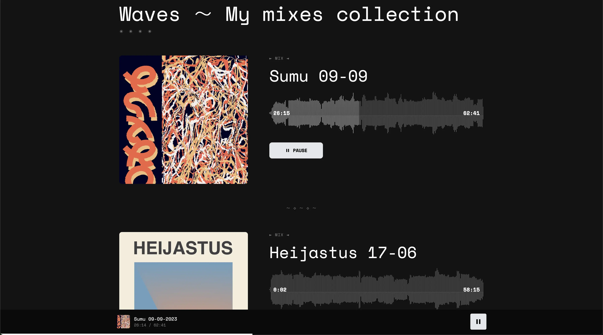

# Waves - Simple audio recordings hosting server

Waves is a simple audio recordings hosting server.
It aims to provide a simple way to host and share audio recordings such as dj mixes with friends.
Just store your audio files in the configured recordings directory and they will be automatically available on the web interface.



## Configuration

Waves is fully configurable through environment variables, making it easy to customize for different deployment scenarios. 
All configuration is optional with sensible defaults.

All audio recordings should be placed in the directory specified by `WAVES_RECORDINGS_PATH` (default: `static/recordings`).
The application will automatically scan this directory for audio files and display them on the web interface.

See the compose.yaml file for a working deployment example with Docker Compose. Recordings are mounted from the `./recordings` directory on the host machine to the container.
```shell
docker compose up -d
```
Then visit `http://localhost:8080` in your browser to see the application in action.

### Audio waveform generation

Waves generates audio waveforms for each recording to provide a visual representation of the audio. The waveforms are generated
by a side Docker container when a new audio file is added to the recordings directory. 
The generated waveforms are stored in the same directory as the audio file with the same base name and a `.json` extension.
For example, if you have an audio file named `mix1.mp3`, the generated waveform will be stored as `mix1.mp3.json` in the same directory.

Alternatively, you can generate the waveform files locally using the [audiowaveform](https://github.com/bbc/audiowaveform) CLI tool.
To generate a waveform file for an audio recording, run the following command:
```shell
audiowaveform -i /path/to/recordings/mix1.mp3 -o /path/to/recordings/mix1.mp3.json --pixels-per-second 1 --bits 8
```

### Artworks

If you want to add custom artwork for your recordings, you can place image files with the same name as the audio file.
The artwork file should be named with the same base name as the audio file and an extension listed in `WAVES_ARTWORK_EXTENSIONS` (default: `jpg,png,webp`).
For example, if you have an audio file named `mix1.mp3`, you can add an artwork file named `mix1.mp3.jpg`.

### Environment Variables

| Variable                         | Description                                                             |
|----------------------------------|-------------------------------------------------------------------------|
| `WAVES_SITE_TITLE`               | Title of the website displayed in header and browser tab                |
| `WAVES_SITE_DESCRIPTION`         | Site description for meta tags and social media                         |
| `WAVES_SITE_FOOTER`              | Text to show in the footer section                                      |
| `WAVES_OUTRO_TITLE`              | Title for the outro/support section                                     |
| `WAVES_OUTRO_DESCRIPTION`        | Description text for the outro/support section                          |
| `WAVES_OUTRO_LINK_URL`           | URL for the external link in the support section                        |
| `WAVES_OUTRO_LINK_TEXT`          | Text for the external link                                              |
| `WAVES_SUPPORTED_AUDIO_FORMATS`  | Comma-separated list of supported audio formats (without dots)          |
| `WAVES_ARTWORK_EXTENSIONS`       | Comma-separated list of artwork file extensions to check (without dots) |
| `WAVES_RECORDINGS_PATH`          | Path where audio recordings are stored                                  |
| `WAVES_ARTWORK_PLACEHOLDER_PATH` | Path to placeholder image for recordings without artwork                |

## Monitoring

Waves exposes Prometheus metrics at the `/metrics` endpoint.
This allows you to monitor the application's performance and usage with tools like Prometheus and Grafana.

## Development

### Code Style

Format code with:
```shell
uv run ruff format .
```

Lint code with:
```shell
uv run ruff check .
```

Update the requirements with:
```shell
uv export --no-dev > requirements.txt
```
